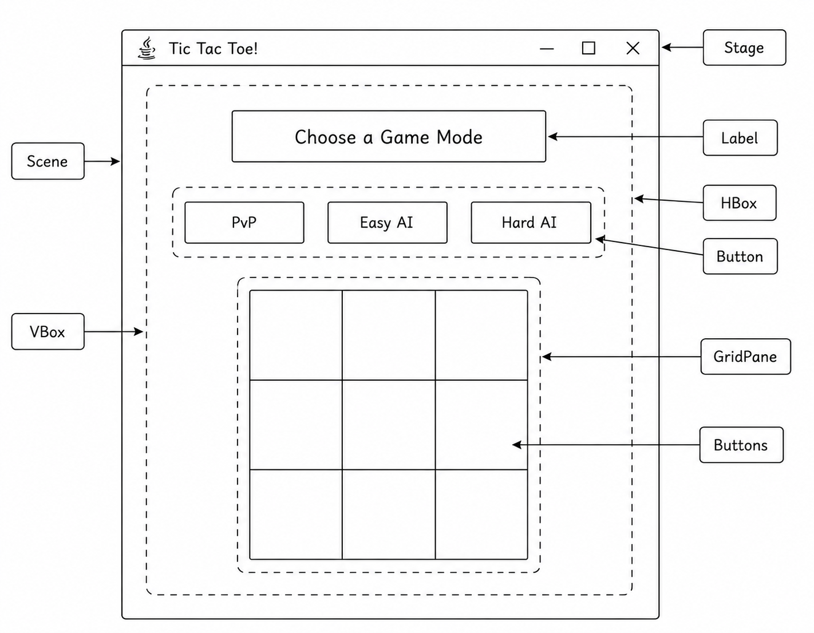
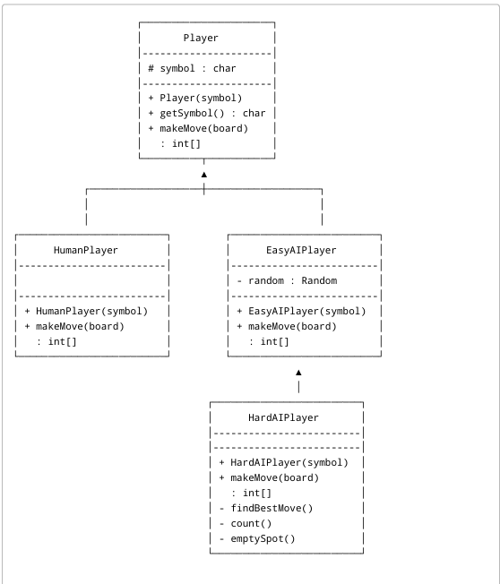
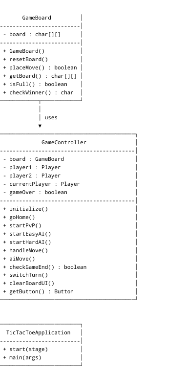
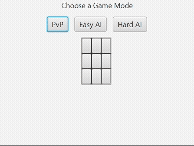

## Project Title
Tic Tac Toe AI Game

---

##  Project Description

The application allows users to play Tic Tac Toe in three different modes:
- Player vs Player (PvP)
- Player vs Easy AI
- Player vs Hard AI

The Easy AI makes random valid moves, while the Hard AI is smart and actually attempts to win or block the player.

The game is built using a GUI created in JavaFX with SceneBuilder and it has a 3x3 interactive board and a menu system for selecting game modes and a status display to show the current game state.

---

##  Features

- 3x3 interactive Tic Tac Toe board
- Player vs Player mode
- Player vs Easy AI mode (random moves)
- Player vs Hard AI mode (blocking + winning strategy)
- Win detection system
- Tie detection system
- Home/menu screen to select game mode
- “Go Home” reset functionality

---
##  GUI Wireframe

---
#  UML Wireframe

---
##  Recording

---

